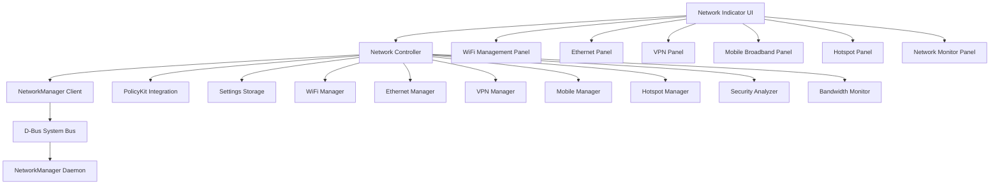

# Design Document: Enhanced Network Indicator

## Overview

The Enhanced Network Indicator is a comprehensive network management system that extends NovaBar's existing network indicator into a full-featured networking interface. The system leverages NetworkManager's D-Bus API to provide complete control over WiFi, Ethernet, VPN, mobile broadband, and hotspot connections while maintaining NovaBar's elegant macOS-style design philosophy.

The design follows a modular architecture with clear separation between network management logic, user interface components, and system integration layers. The system integrates seamlessly with existing NovaBar infrastructure while providing extensible components for future network management features.

## Architecture

### High-Level Architecture



### Component Architecture

The system is organized into three primary layers:

1. **Presentation Layer**: GTK3-based user interface components
2. **Business Logic Layer**: Network management controllers and services
3. **Integration Layer**: NetworkManager D-Bus client and system integration

## Components and Interfaces

### Core Components

#### NetworkIndicator (Main Component)
```vala
public class NetworkIndicator : Gtk.Box {
    private NetworkController controller;
    private IndicatorIcon main_icon;
    private NetworkPopover popover;
    
    public signal void network_changed(NetworkState state);
    public signal void connection_status_changed(string connection_id, ConnectionStatus status);
    
    public void update_indicator_state(NetworkState state);
    public void show_notification(string message, NotificationType type);
}
```

#### NetworkController (Business Logic Coordinator)
```vala
public class NetworkController : GLib.Object {
    private NM.Client nm_client;
    private WiFiManager wifi_manager;
    private EthernetManager ethernet_manager;
    private VPNManager vpn_manager;
    private MobileManager mobile_manager;
    private HotspotManager hotspot_manager;
    private SecurityAnalyzer security_analyzer;
    private BandwidthMonitor bandwidth_monitor;
    private PolicyKitClient polkit_client;
    
    public signal void state_changed(NetworkState state);
    public signal void connection_added(NetworkConnection connection);
    public signal void connection_removed(string connection_id);
    public signal void security_alert(SecurityAlert alert);
    
    public async bool connect_to_network(string connection_id, Credentials? credentials = null);
    public async bool disconnect_from_network(string connection_id);
    public async List<NetworkConnection> get_available_networks();
    public async NetworkState get_current_state();
}
```

### Network Management Components

#### WiFiManager
```vala
public class WiFiManager : GLib.Object {
    private NM.Client nm_client;
    private List<WiFiNetwork> available_networks;
    private WiFiNetwork? active_connection;
    
    public signal void networks_updated(List<WiFiNetwork> networks);
    public signal void connection_state_changed(WiFiNetwork network, ConnectionState state);
    public signal void scan_completed();
    
    public async bool connect_to_network(WiFiNetwork network, string? password = null);
    public async bool disconnect_from_network(WiFiNetwork network);
    public async bool forget_network(WiFiNetwork network);
    public async bool connect_to_hidden_network(string ssid, string password, SecurityType security);
    public async void start_scan();
    public List<WiFiNetwork> get_available_networks();
}
```

#### VPNManager
```vala
public class VPNManager : GLib.Object {
    private NM.Client nm_client;
    private List<VPNProfile> vpn_profiles;
    private VPNProfile? active_vpn;
    
    public signal void vpn_state_changed(VPNProfile profile, VPNState state);
    public signal void profiles_updated(List<VPNProfile> profiles);
    
    public async bool connect_vpn(VPNProfile profile);
    public async bool disconnect_vpn(VPNProfile profile);
    public async bool import_vpn_profile(string config_file_path);
    public async bool create_vpn_profile(VPNConfiguration config);
    public async bool delete_vpn_profile(VPNProfile profile);
    public List<VPNProfile> get_vpn_profiles();
}
```

#### HotspotManager
```vala
public class HotspotManager : GLib.Object {
    private NM.Client nm_client;
    private HotspotConfiguration? active_hotspot;
    private List<ConnectedDevice> connected_devices;
    
    public signal void hotspot_state_changed(HotspotState state);
    public signal void device_connected(ConnectedDevice device);
    public signal void device_disconnected(ConnectedDevice device);
    
    public async bool create_hotspot(HotspotConfiguration config);
    public async bool stop_hotspot();
    public async bool update_hotspot_config(HotspotConfiguration config);
    public List<ConnectedDevice> get_connected_devices();
    public DataUsage get_hotspot_usage();
}
```

### Security and Monitoring Components

#### SecurityAnalyzer
```vala
public class SecurityAnalyzer : GLib.Object {
    public signal void security_alert(SecurityAlert alert);
    public signal void captive_portal_detected(NetworkConnection connection);
    
    public async SecurityAssessment analyze_network(NetworkConnection connection);
    public async bool detect_captive_portal(NetworkConnection connection);
    public async List<SecurityRecommendation> get_security_recommendations();
    public bool is_network_secure(NetworkConnection connection);
}
```

#### BandwidthMonitor
```vala
public class BandwidthMonitor : GLib.Object {
    private Timer update_timer;
    private Dictionary<string, BandwidthData> connection_usage;
    
    public signal void bandwidth_updated(BandwidthData data);
    public signal void usage_threshold_exceeded(string connection_id, DataUsage usage);
    
    public async SpeedTestResult perform_speed_test();
    public BandwidthData get_current_bandwidth();
    public DataUsage get_usage_for_connection(string connection_id);
    public void set_usage_threshold(string connection_id, uint64 threshold);
}
```

### User Interface Components

#### NetworkPopover (Main UI Container)
```vala
public class NetworkPopover : Gtk.Popover {
    private Gtk.Stack main_stack;
    private WiFiPanel wifi_panel;
    private EthernetPanel ethernet_panel;
    private VPNPanel vpn_panel;
    private MobilePanel mobile_panel;
    private HotspotPanel hotspot_panel;
    private MonitorPanel monitor_panel;
    private SettingsPanel settings_panel;
    
    public void show_panel(PanelType panel_type);
    public void update_network_list();
    public void show_connection_dialog(NetworkConnection connection);
}
```

#### WiFiPanel
```vala
public class WiFiPanel : Gtk.Box {
    private Gtk.ListBox network_list;
    private Gtk.SearchEntry search_entry;
    private Gtk.Button refresh_button;
    private Gtk.Button hidden_network_button;
    
    public signal void network_selected(WiFiNetwork network);
    public signal void refresh_requested();
    public signal void hidden_network_requested();
    
    public void update_network_list(List<WiFiNetwork> networks);
    public void show_connection_progress(WiFiNetwork network);
    public void show_password_dialog(WiFiNetwork network);
}
```

## Data Models

### Core Data Structures

#### NetworkConnection
```vala
public class NetworkConnection : GLib.Object {
    public string id { get; set; }
    public string name { get; set; }
    public ConnectionType type { get; set; }
    public ConnectionState state { get; set; }
    public string? device_path { get; set; }
    public DateTime last_connected { get; set; }
    public bool auto_connect { get; set; }
    public SecurityLevel security_level { get; set; }
    
    public abstract async bool connect(Credentials? credentials = null);
    public abstract async bool disconnect();
    public abstract ConnectionInfo get_connection_info();
}
```

#### WiFiNetwork (extends NetworkConnection)
```vala
public class WiFiNetwork : NetworkConnection {
    public string ssid { get; set; }
    public string bssid { get; set; }
    public uint8 signal_strength { get; set; }
    public SecurityType security_type { get; set; }
    public WiFiMode mode { get; set; }
    public uint32 frequency { get; set; }
    public bool is_hidden { get; set; }
    
    public string get_security_description();
    public string get_signal_strength_description();
}
```

#### VPNProfile
```vala
public class VPNProfile : GLib.Object {
    public string id { get; set; }
    public string name { get; set; }
    public VPNType type { get; set; }
    public string server_address { get; set; }
    public string username { get; set; }
    public VPNState state { get; set; }
    public bool auto_connect { get; set; }
    public DateTime created_date { get; set; }
    
    public async bool connect();
    public async bool disconnect();
    public VPNConfiguration get_configuration();
}
```

#### HotspotConfiguration
```vala
public class HotspotConfiguration : GLib.Object {
    public string ssid { get; set; }
    public string password { get; set; }
    public SecurityType security_type { get; set; }
    public string device_interface { get; set; }
    public string shared_connection_id { get; set; }
    public uint8 channel { get; set; }
    public bool hidden { get; set; }
    public uint32 max_clients { get; set; }
}
```

### Enumerations

```vala
public enum ConnectionType {
    WIFI,
    ETHERNET,
    VPN,
    MOBILE_BROADBAND,
    HOTSPOT
}

public enum ConnectionState {
    DISCONNECTED,
    CONNECTING,
    CONNECTED,
    DISCONNECTING,
    FAILED
}

public enum SecurityType {
    NONE,
    WEP,
    WPA_PSK,
    WPA2_PSK,
    WPA3_PSK,
    WPA_ENTERPRISE,
    WPA2_ENTERPRISE,
    WPA3_ENTERPRISE
}

public enum VPNType {
    OPENVPN,
    WIREGUARD,
    PPTP,
    L2TP,
    SSTP
}

public enum SecurityLevel {
    SECURE,
    WARNING,
    INSECURE,
    UNKNOWN
}
```

## Correctness Properties

*A property is a characteristic or behavior that should hold true across all valid executions of a system—essentially, a formal statement about what the system should do. Properties serve as the bridge between human-readable specifications and machine-verifiable correctness guarantees.*

Before defining the correctness properties, I need to analyze the acceptance criteria from the requirements document to determine which ones are testable as properties.

### Property Reflection

After analyzing all acceptance criteria, I identified several areas where properties can be consolidated to eliminate redundancy:

**Connection Management Consolidation:**
- Properties 1.1, 3.1, 4.1, 5.1 all test connection initiation across different network types - can be combined into one comprehensive connection property
- Properties 1.5, 2.5, 3.5, 5.6 all test error handling across network types - can be combined into one error handling property
- Properties 1.7, 11.5 both test data persistence - can be combined

**Status Display Consolidation:**
- Properties 1.6, 2.6, 4.2, 5.3, 6.5 all test that network information is displayed - can be combined into one display property
- Properties 9.2, 3.2 both test status indicator updates - can be combined

**Monitoring Consolidation:**
- Properties 6.1, 6.3, 6.6 all test bandwidth monitoring - can be combined into one comprehensive monitoring property
- Properties 6.4, 8.4 both test alerting mechanisms - can be combined

**UI Consistency Consolidation:**
- Properties 9.1, 9.4, 9.7 all test UI organization and information display - can be combined
- Properties 10.1, 10.2 both test accessibility features - can be combined

### Correctness Properties

Based on the prework analysis and property reflection, here are the consolidated correctness properties:

**Property 1: Network Connection Initiation**
*For any* network connection request (WiFi, VPN, mobile broadband, or hotspot), initiating connection should result in appropriate authentication prompts and connection establishment attempts
**Validates: Requirements 1.1, 3.1, 4.1, 5.1**

**Property 2: Connection Profile Persistence**
*For any* successfully established network connection, the connection profile should be automatically saved and retrievable after system restart
**Validates: Requirements 1.7, 11.5**

**Property 3: Network Information Display**
*For any* visible network connection, the display should include all available connection information (signal strength, security type, connection status, speed, etc.)
**Validates: Requirements 1.6, 2.6, 4.2, 5.3, 6.5**

**Property 4: Connection Error Handling**
*For any* failed network connection attempt, the system should display specific error messages and provide appropriate remediation options
**Validates: Requirements 1.5, 2.5, 3.5, 5.6**

**Property 5: Status Indicator Updates**
*For any* network state change, the main indicator icon should update immediately to reflect the current connection status
**Validates: Requirements 9.2, 3.2**

**Property 6: Input Validation**
*For any* user input requiring validation (IP addresses, passwords, configuration values), invalid inputs should be rejected with descriptive error messages
**Validates: Requirements 2.4, 3.6**

**Property 7: Automatic Network Detection**
*For any* network interface state change (cable connection/disconnection, modem detection), the system should automatically detect and update status within the specified response time
**Validates: Requirements 2.1, 2.2, 4.1**

**Property 8: Bandwidth Monitoring**
*For any* active network connection, the system should continuously track and accurately report bandwidth usage, speed, and quality metrics
**Validates: Requirements 6.1, 6.3, 6.6**

**Property 9: Security Analysis and Alerting**
*For any* network connection, the system should perform security analysis and alert users to potential risks or suspicious activity
**Validates: Requirements 8.1, 8.2, 8.3, 8.4, 6.4**

**Property 10: VPN Connection Management**
*For any* VPN profile operation (connect, disconnect, import, CRUD), the system should handle the operation correctly and update routing appropriately
**Validates: Requirements 3.3, 3.6, 3.7**

**Property 11: Network Profile Management**
*For any* network profile operation (create, switch, delete), the system should maintain profile integrity and apply configurations correctly
**Validates: Requirements 7.1, 7.2, 7.4**

**Property 12: Data Usage Monitoring**
*For any* metered connection (mobile broadband, hotspot), the system should accurately track usage and warn when approaching user-defined limits
**Validates: Requirements 4.3, 4.4**

**Property 13: UI Organization and Accessibility**
*For any* network list display, networks should be organized hierarchically by type and priority, with complete keyboard navigation and screen reader support
**Validates: Requirements 9.1, 9.4, 9.7, 10.1, 10.2**

**Property 14: Privilege Management**
*For any* operation requiring elevated privileges, the system should integrate with PolicyKit for secure authentication and handle insufficient permissions gracefully
**Validates: Requirements 10.3, 10.4**

**Property 15: System Integration and Fallback**
*For any* system state (NetworkManager available/unavailable, resource constraints), the system should maintain core functionality and provide appropriate fallback behavior
**Validates: Requirements 11.2, 11.7**

**Property 16: Progress Indication and Cancellation**
*For any* long-running network operation, the system should display progress indicators and allow user cancellation
**Validates: Requirements 9.6**

**Property 17: Error Feedback Mechanisms**
*For any* error condition, the system should provide both visual and auditory feedback options as configured by the user
**Validates: Requirements 10.7**

## Error Handling

The Enhanced Network Indicator implements comprehensive error handling across all network operations:

### Error Categories

1. **Connection Errors**: Failed WiFi authentication, VPN connection timeouts, ethernet cable issues
2. **Configuration Errors**: Invalid IP addresses, malformed VPN profiles, unsupported security types
3. **System Errors**: NetworkManager unavailable, insufficient permissions, hardware failures
4. **User Input Errors**: Invalid passwords, malformed SSIDs, out-of-range values

### Error Handling Strategy

- **Graceful Degradation**: Core functionality remains available even when advanced features fail
- **User-Friendly Messages**: Technical errors are translated into actionable user guidance
- **Automatic Recovery**: System attempts automatic reconnection and fallback options
- **Logging and Diagnostics**: Detailed error information is logged for troubleshooting

### Error Recovery Mechanisms

```vala
public class ErrorHandler : GLib.Object {
    public signal void error_occurred(NetworkError error);
    public signal void recovery_attempted(RecoveryAction action);
    
    public async bool handle_connection_error(ConnectionError error);
    public async bool attempt_automatic_recovery(NetworkConnection connection);
    public void show_user_error_dialog(string message, ErrorSeverity severity);
    public void log_error_for_diagnostics(NetworkError error);
}
```

## Testing Strategy

The Enhanced Network Indicator employs a dual testing approach combining unit tests for specific scenarios and property-based tests for comprehensive coverage.

### Unit Testing Approach

Unit tests focus on:
- **Specific Examples**: Testing concrete scenarios like connecting to a known WiFi network
- **Edge Cases**: Testing boundary conditions like maximum password lengths, invalid IP ranges
- **Integration Points**: Testing interactions between components like NetworkManager D-Bus calls
- **Error Conditions**: Testing specific error scenarios and recovery mechanisms

### Property-Based Testing Approach

Property-based tests validate universal properties across randomized inputs:
- **Minimum 100 iterations** per property test to ensure comprehensive coverage
- **Random input generation** for network configurations, credentials, and system states
- **Property validation** against the 17 correctness properties defined above
- **Tag format**: **Feature: enhanced-network-indicator, Property {number}: {property_text}**

### Testing Configuration

The testing framework uses:
- **Vala Test Framework**: For unit test structure and assertions
- **GLib Test Suite**: For property-based testing with random input generation
- **Mock NetworkManager**: For testing without requiring actual network hardware
- **PolicyKit Mock**: For testing privilege escalation without system modifications

### Test Coverage Requirements

- **100% coverage** of all public API methods
- **All 17 correctness properties** implemented as property-based tests
- **Error path coverage** for all identified error conditions
- **Accessibility testing** using automated accessibility validation tools
- **Performance testing** for response time requirements

### Example Property Test Structure

```vala
public void test_property_1_network_connection_initiation() {
    // Feature: enhanced-network-indicator, Property 1: Network Connection Initiation
    for (int i = 0; i < 100; i++) {
        var network = generate_random_network_connection();
        var credentials = generate_random_credentials(network);
        
        var result = network_controller.connect_to_network(network.id, credentials);
        
        assert(result.authentication_prompted == network.requires_authentication);
        assert(result.connection_attempted == true);
    }
}
```

This comprehensive testing strategy ensures that the Enhanced Network Indicator maintains reliability and correctness across all supported network operations and user interactions.