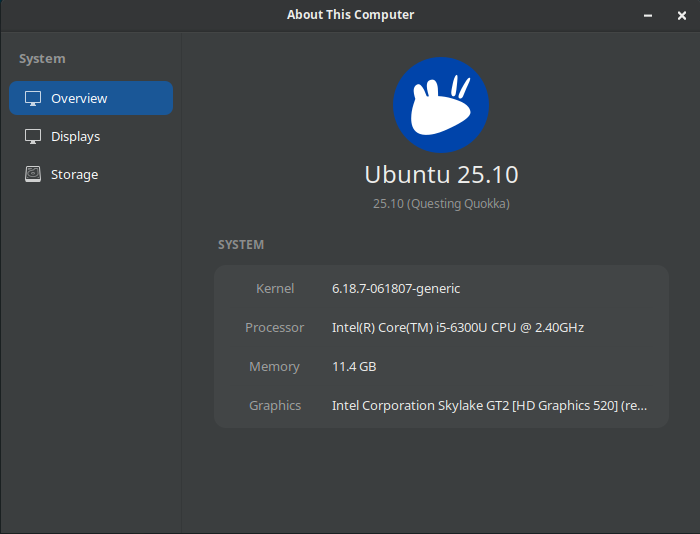
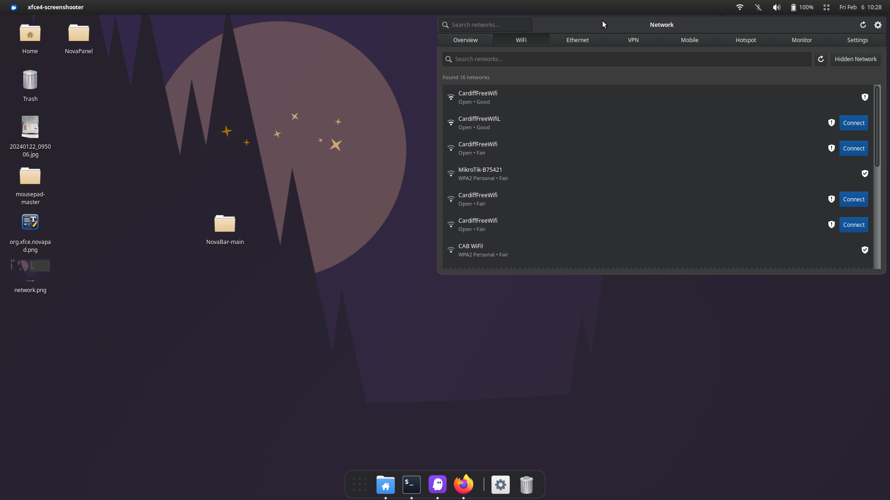

[](https://ko-fi.com/novadesktop)
# NovaBar

A modern, modular macOS-style panel for Linux supporting both X11 and Wayland.


## Features

### Core Components
- **Global Menu Bar** - Application menus integrated into the panel, supporting both `org.gtk.Menus` and `com.canonical.dbusmenu` protocols
- **Logo Menu** - System actions menu with Nova branding
- **System Indicators** - Network, Bluetooth, Sound, Battery, DateTime, Notifications
- **Control Center** - Quick access to system settings
- **Settings Panel** - Theme customization and configuration

### Key Features
- **macOS-style Design** - Clean, modern interface with transparency effects
- **X11 & Wayland Support** - Native support for both display servers
- **Global Menu Integration** - Application menus appear in the panel with automatic in-app menubar hiding
- **AppMenu Registrar** - Built-in `com.canonical.AppMenu.Registrar` D-Bus service for menu registration
- **Window Tracking** - Shows focused window on Wayland via wlr-foreign-toplevel
- **Enhanced Bluetooth** - Full Bluetooth management with pairing, audio profiles, and file transfer
- **Enhanced Network** - Comprehensive network management with WiFi, VPN, hotspot, and bandwidth monitoring
- **System Tray Replacement** - Modern indicators replace traditional system tray
- **Theme Support** - Dark and light themes with CSS customization
- **Modular Architecture** - Easy to extend with new indicators and components

## Screenshots

| Feature | Screenshot |
|---------|------------|
| Logo Menu |  |
| Global Menu |  |
| Global Menu2 |  |
| About |  |
| Network |  |
| Network Settings |  |

## Requirements

### System Dependencies
- GTK+ 3.0
- GLib 2.0
- GIO 2.0
- GDK X11 3.0
- libwnck 3.0 (X11 window tracking)
- X11
- NetworkManager (libnm)
- libsoup 3.0 (HTTP client, optional - for speed tests)

### Wayland Dependencies (optional)
- gtk-layer-shell (panel positioning)
- wayland-client (protocol support)

### Global Menu Dependencies
- **appmenu-gtk3-module** (required) - Intercepts GTK3 application menubars and exports them via D-Bus
- **appmenu-gtk2-module** (optional) - Same for legacy GTK2 applications

> **Note:** NovaBar automatically configures `GTK_MODULES`, `gtk-shell-shows-menubar`, and other settings on first run. A **logout/login** is required after first launch for all applications to pick up the global menu environment.

### Build Dependencies
- Vala compiler
- Meson build system (>= 0.50.0)
- Ninja build tool
- pkg-config
- wayland-scanner (for Wayland support)
- gettext (for translations)

### Runtime Requirements
- X11 or Wayland (wlroots-based: labwc, sway, wayfire, etc.)
- XFCE or compatible desktop environment
- appmenu-gtk3-module (for global menu support)

## Installation

### From Source

1. **Install dependencies** (Ubuntu/Debian):
```bash
sudo apt install valac meson ninja-build pkg-config gettext \
    libgtk-3-dev libglib2.0-dev libgio2.0-dev \
    libgdk-x11-3.0-dev libwnck-3-dev libx11-dev \
    libnm-dev libsoup-3.0-dev \
    libgtk-layer-shell-dev libwayland-dev \
    appmenu-gtk3-module
```

**Arch Linux:**
```bash
sudo pacman -S vala meson ninja pkgconf gtk3 libwnck3 \
    networkmanager libsoup3 gtk-layer-shell wayland gettext \
    appmenu-gtk-module
```

**Fedora:**
```bash
sudo dnf install vala meson ninja-build pkgconf gtk3-devel libwnck3-devel \
    NetworkManager-libnm-devel libsoup3-devel \
    gtk-layer-shell-devel wayland-devel gettext \
    libdbusmenu-gtk3
```

2. **Clone and build**:
```bash
git clone https://github.com/novik133/NovikBar.git
cd NovaBar
meson setup build
ninja -C build
```

3. **Build without Wayland** (X11 only):
```bash
meson setup build -Dwayland=false
ninja -C build
```

4. **Install**:
```bash
sudo ninja -C build install
```

5. **Run**:
```bash
novabar
```

### Auto-start Setup

The autostart file is installed automatically. To set up manually:
```bash
mkdir -p ~/.config/autostart
cp /etc/xdg/autostart/novabar-autostart.desktop ~/.config/autostart/
```

NovaBar's autostart entry runs in the **Panel** phase (before other applications) to ensure the global menu registrar and environment are ready before apps launch.

## Configuration

### Global Menu Setup

NovaBar handles global menu configuration **automatically** on startup. It:

1. Sets `GTK_MODULES=appmenu-gtk-module` in the session environment
2. Propagates the setting via `dbus-update-activation-environment`, `~/.xprofile`, and `~/.config/environment.d/`
3. Sets `gtk-shell-shows-menubar=true` via xfconf (XFCE) and `gtk-3.0/settings.ini`
4. Writes a GTK3 CSS override to hide in-app menubars
5. Starts the `com.canonical.AppMenu.Registrar` D-Bus service

**The only manual step required is installing the module:**
```bash
# Ubuntu/Debian
sudo apt install appmenu-gtk3-module

# Arch Linux
sudo pacman -S appmenu-gtk-module
```

**After first launch, log out and log back in** so all applications pick up the `GTK_MODULES` environment variable.

#### How It Works

- `appmenu-gtk-module` intercepts `GtkMenuBar` widgets in GTK applications
- The module exports menus via `org.gtk.Menus` D-Bus interface
- NovaBar reads these menus and displays them in the panel
- The in-app menubar is automatically hidden (collapsed to zero height)
- NovaBar also hosts a `com.canonical.AppMenu.Registrar` for apps using `com.canonical.dbusmenu` (Qt, Electron, etc.)

#### Troubleshooting Global Menu

- **Menus not appearing:** Ensure `appmenu-gtk3-module` is installed and you have logged out/in after first NovaBar launch
- **Menu shows in both panel and app:** The app was launched before NovaBar configured the environment — restart the app
- **Specific app not working:** Some apps (e.g. Firefox with native titlebar) don't use GtkMenuBar and won't export menus

### Wayland Setup

NovaBar automatically detects Wayland and uses:
- **gtk-layer-shell** for panel positioning
- **wlr-foreign-toplevel-management** for window tracking

Supported compositors:
- labwc
- sway
- wayfire
- Hyprland
- Other wlroots-based compositors

### Theme Customization

NovaBar includes two built-in themes:
- **Dark Theme** (`novaos.css`) - Default dark theme
- **Light Theme** (`novaos-light.css`) - Light variant

Themes are installed to `/usr/share/novaos/` and can be customized via the Settings panel.

## Project Structure

```
NovaBar/
├── src/
│   ├── main.vala              # Application entry point
│   ├── panel.vala             # Main panel window and layout
│   ├── backend/               # X11/Wayland abstraction
│   │   ├── backend.vala       # Runtime detection
│   │   ├── x11.vala           # X11 panel setup
│   │   ├── wayland.vala       # Wayland panel setup
│   │   └── popup.vala         # Cross-platform popups
│   ├── toplevel/              # Window tracking
│   │   ├── tracker.vala       # Abstract interface
│   │   ├── x11.vala           # libwnck tracking
│   │   └── wayland.vala       # wlr-foreign-toplevel
│   ├── wayland/               # Wayland protocol code
│   │   ├── wlr-toplevel.c     # Protocol implementation
│   │   ├── wlr-toplevel.h     # Header
│   │   └── wlr-toplevel.vapi  # Vala bindings
│   ├── globalmenu/            # Global menu integration
│   │   ├── menubar.vala       # Menu bar widget (org.gtk.Menus + dbusmenu)
│   │   ├── registrar.vala     # com.canonical.AppMenu.Registrar service
│   │   └── dbusmenu_client.vala # com.canonical.dbusmenu client
│   ├── logomenu/              # Nova logo menu
│   ├── indicators/            # System indicators
│   │   ├── network/
│   │   ├── bluetooth/
│   │   ├── sound/
│   │   ├── battery/
│   │   ├── datetime/
│   │   ├── notifications/
│   │   └── controlcenter/
│   ├── settings/              # Configuration interface
│   └── about/                 # About dialog
├── protocols/                 # Wayland protocol XML
├── data/
│   ├── novaos.css             # Dark theme stylesheet
│   ├── novaos-light.css       # Light theme stylesheet
│   ├── com.canonical.AppMenu.Registrar.service  # D-Bus service file
│   └── icons/                 # Application icons
├── po/                        # Translation files (.po/.pot)
│   ├── novabar.pot            # Translation template
│   ├── pl.po, de.po, fr.po   # Language translations
│   ├── POTFILES               # Source files with translatable strings
│   └── LINGUAS                # Supported languages list
├── Screenshots/
├── meson.build
├── meson_options.txt
├── CHANGELOG.md
├── LICENCE.md
└── README.md
```

## Development

### Building for Development

```bash
meson setup build --buildtype=debug
ninja -C build
./build/novabar
```

### Adding New Indicators

1. Create new directory in `src/indicators/`
2. Implement indicator class extending appropriate base
3. Add to `meson.build` sources
4. Register in `panel.vala` right_box

### Code Style

- Follow Vala conventions
- Use 4-space indentation
- Document public APIs
- Maintain modular architecture

## Troubleshooting

### Global Menu Not Working
- Ensure `appmenu-gtk3-module` is installed: `sudo apt install appmenu-gtk3-module`
- Log out and log back in after first NovaBar launch
- Restart applications that were running before NovaBar started
- Verify with: `echo $GTK_MODULES` (should contain `appmenu-gtk-module`)

### Panel Not Appearing
- Check X11/Wayland compatibility
- Verify dependencies are installed
- Run from terminal to see error messages

### Wayland Issues
- Ensure compositor supports wlr-foreign-toplevel-management
- Check gtk-layer-shell is installed
- Verify wayland-client is available

### High CPU Usage
- Check for window manager conflicts
- Disable other panels/docks
- Monitor system resources

## Contributing

1. Fork the repository
2. Create feature branch
3. Make changes following code style
4. Test thoroughly on both X11 and Wayland
5. Submit pull request

## License

GPL-3.0 - See [LICENCE](LICENCE.md) for details.

## Credits

- Built with Vala and GTK3
- Inspired by macOS design principles
- Uses libwnck for X11 window management
- Uses gtk-layer-shell for Wayland support
- Uses wlr-foreign-toplevel-management for Wayland window tracking
- NetworkManager integration for network status

---

**NovaBar** - Bringing macOS-style elegance to Linux desktops.
