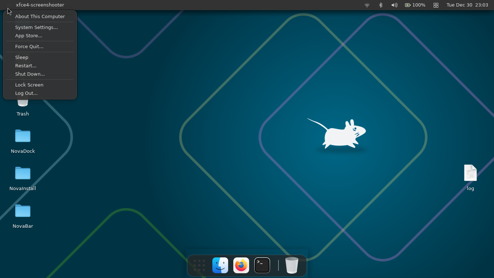
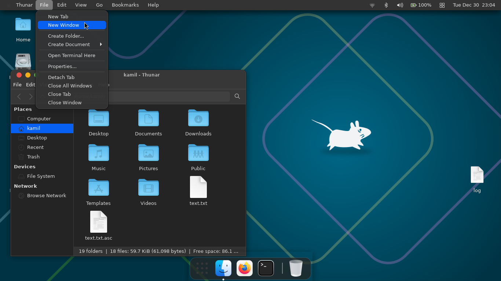
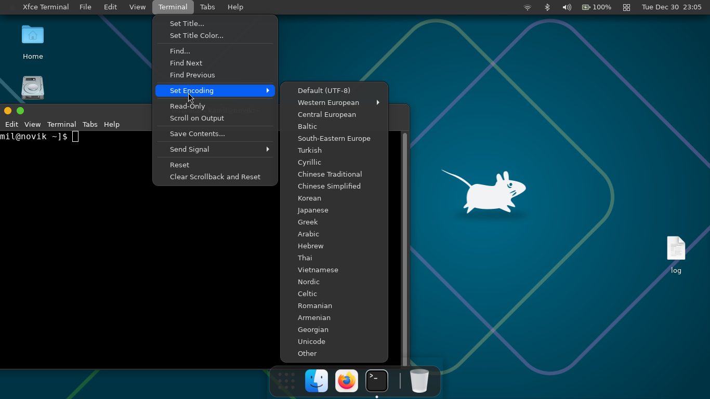
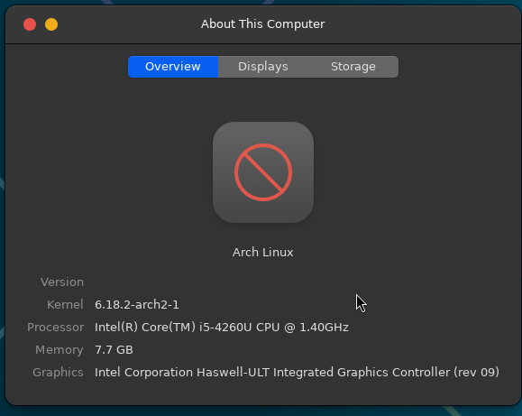
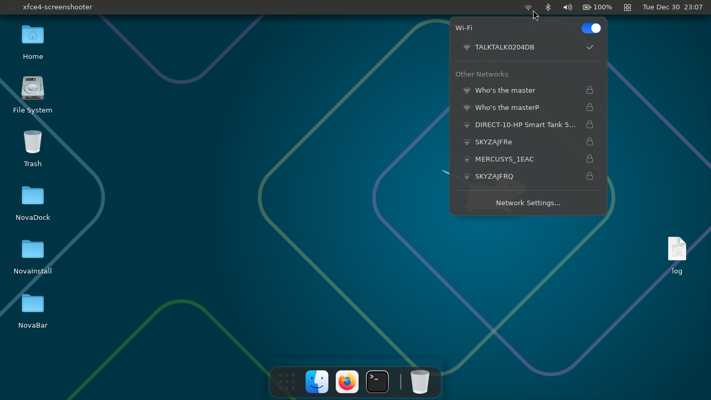

# NovaBar

A modern, modular macOS-style panel for Linux supporting both X11 and Wayland.



## Features

### Core Components
- **Global Menu Bar** - Application menus integrated into the panel (X11), focused window title (Wayland)
- **Logo Menu** - System actions menu with Nova branding
- **System Indicators** - Network, Bluetooth, Sound, Battery, DateTime, Notifications
- **Control Center** - Quick access to system settings
- **Settings Panel** - Theme customization and configuration

### Key Features
- **macOS-style Design** - Clean, modern interface with transparency effects
- **X11 & Wayland Support** - Native support for both display servers
- **Global Menu Integration** - Application menus appear in the panel (X11)
- **Window Tracking** - Shows focused window on Wayland via wlr-foreign-toplevel
- **System Tray Replacement** - Modern indicators replace traditional system tray
- **Theme Support** - Dark and light themes with CSS customization
- **Modular Architecture** - Easy to extend with new indicators and components

## Screenshots

| Feature | Screenshot |
|---------|------------|
| Main Panel |  |
| Global Menu |  |
| Global Menu2 |  |
| Indicators |  |
| Logo Menu |  |

## Requirements

### System Dependencies
- GTK+ 3.0
- GLib 2.0
- GIO 2.0
- GDK X11 3.0
- libwnck 3.0 (X11 window tracking)
- X11
- NetworkManager (libnm)

### Wayland Dependencies (optional)
- gtk-layer-shell (panel positioning)
- wayland-client (protocol support)

### Build Dependencies
- Vala compiler
- Meson build system
- Ninja build tool
- pkg-config
- wayland-scanner (for Wayland support)

### Runtime Requirements
- X11 or Wayland (wlroots-based: labwc, sway, wayfire, etc.)
- XFCE or compatible desktop environment
- appmenu-gtk-module (for global menu support on X11)

## Installation

### From Source

1. **Install dependencies** (Ubuntu/Debian):
```bash
sudo apt install valac meson ninja-build pkg-config \
    libgtk-3-dev libglib2.0-dev libgio2.0-dev \
    libgdk-x11-3.0-dev libwnck-3-dev libx11-dev \
    libnm-dev appmenu-gtk-module \
    libgtk-layer-shell-dev libwayland-dev
```

**Arch Linux:**
```bash
sudo pacman -S vala meson ninja pkgconf gtk3 libwnck3 \
    networkmanager gtk-layer-shell wayland
```

2. **Clone and build**:
```bash
git clone https://github.com/novik133/NovikBar.git
cd NovaBar
meson setup build
ninja -C build
```

3. **Build without Wayland** (X11 only):
```bash
meson setup build -Dwayland=false
ninja -C build
```

4. **Install**:
```bash
sudo ninja -C build install
```

5. **Run**:
```bash
novabar
```

### Auto-start Setup

Create desktop entry for auto-start:
```bash
mkdir -p ~/.config/autostart
cat > ~/.config/autostart/novabar.desktop << EOF
[Desktop Entry]
Type=Application
Name=NovaBar
Exec=novabar
Hidden=false
NoDisplay=false
X-GNOME-Autostart-enabled=true
EOF
```

## Configuration

### Global Menu Setup (X11)

For applications to show menus in the panel:

1. **Install appmenu support**:
```bash
sudo apt install appmenu-gtk2-module appmenu-gtk3-module
```

2. **Set environment variables**:
```bash
export UBUNTU_MENUPROXY=1
export APPMENU_DISPLAY_BOTH=1
```

Add to `~/.profile` or `~/.xsessionrc` for persistence.

### Wayland Setup

NovaBar automatically detects Wayland and uses:
- **gtk-layer-shell** for panel positioning
- **wlr-foreign-toplevel-management** for window tracking

Supported compositors:
- labwc
- sway
- wayfire
- Hyprland
- Other wlroots-based compositors

### Theme Customization

NovaBar includes two built-in themes:
- **Dark Theme** (`novaos.css`) - Default dark theme
- **Light Theme** (`novaos-light.css`) - Light variant

Themes are installed to `/usr/share/novaos/` and can be customized via the Settings panel.

## Project Structure

```
NovaBar/
├── src/
│   ├── main.vala              # Application entry point
│   ├── panel.vala             # Main panel window and layout
│   ├── backend/               # X11/Wayland abstraction
│   │   ├── backend.vala       # Runtime detection
│   │   ├── x11.vala           # X11 panel setup
│   │   ├── wayland.vala       # Wayland panel setup
│   │   └── popup.vala         # Cross-platform popups
│   ├── toplevel/              # Window tracking
│   │   ├── tracker.vala       # Abstract interface
│   │   ├── x11.vala           # libwnck tracking
│   │   └── wayland.vala       # wlr-foreign-toplevel
│   ├── wayland/               # Wayland protocol code
│   │   ├── wlr-toplevel.c     # Protocol implementation
│   │   ├── wlr-toplevel.h     # Header
│   │   └── wlr-toplevel.vapi  # Vala bindings
│   ├── globalmenu/            # Global menu integration
│   ├── logomenu/              # Nova logo menu
│   ├── indicators/            # System indicators
│   │   ├── network/
│   │   ├── bluetooth/
│   │   ├── sound/
│   │   ├── battery/
│   │   ├── datetime/
│   │   ├── notifications/
│   │   └── controlcenter/
│   ├── settings/              # Configuration interface
│   └── about/                 # About dialog
├── protocols/                 # Wayland protocol XML
├── data/
│   ├── novaos.css             # Dark theme stylesheet
│   └── novaos-light.css       # Light theme stylesheet
├── Screenshots/
├── meson.build
├── meson_options.txt
├── CHANGELOG.md
├── LICENCE.md
└── README.md
```

## Development

### Building for Development

```bash
meson setup build --buildtype=debug
ninja -C build
./build/novabar
```

### Adding New Indicators

1. Create new directory in `src/indicators/`
2. Implement indicator class extending appropriate base
3. Add to `meson.build` sources
4. Register in `panel.vala` right_box

### Code Style

- Follow Vala conventions
- Use 4-space indentation
- Document public APIs
- Maintain modular architecture

## Troubleshooting

### Global Menu Not Working (X11)
- Ensure `appmenu-gtk-module` is installed
- Check environment variables are set
- Restart applications after setup

### Panel Not Appearing
- Check X11/Wayland compatibility
- Verify dependencies are installed
- Run from terminal to see error messages

### Wayland Issues
- Ensure compositor supports wlr-foreign-toplevel-management
- Check gtk-layer-shell is installed
- Verify wayland-client is available

### High CPU Usage
- Check for window manager conflicts
- Disable other panels/docks
- Monitor system resources

## Contributing

1. Fork the repository
2. Create feature branch
3. Make changes following code style
4. Test thoroughly on both X11 and Wayland
5. Submit pull request

## License

GPL-3.0 - See [LICENCE](LICENCE.md) for details.

## Credits

- Built with Vala and GTK3
- Inspired by macOS design principles
- Uses libwnck for X11 window management
- Uses gtk-layer-shell for Wayland support
- Uses wlr-foreign-toplevel-management for Wayland window tracking
- NetworkManager integration for network status

---

**NovaBar** - Bringing macOS-style elegance to Linux desktops.
